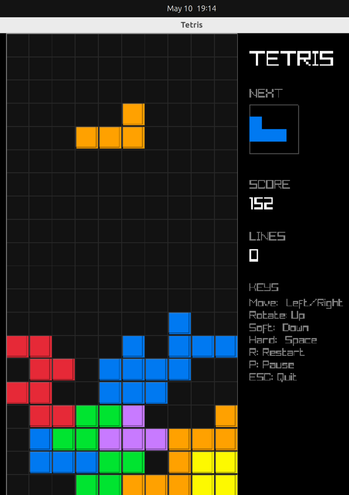

## Prerequisites

- **Compiler:** g++ with C++17 support
- **Libraries:** Raylib, SDL2, GL, X11 development packages
- **Sysroot:** A sysroot at `/tmp/opencode/tetris-sysroot` with the required shared libs (or override `SYSROOT` in the Makefile)

## Quick Start (Ubuntu/Debian)

```sh
# 1. Install dependencies
make install-deps

# 2. Build
make

# 3. Run
make run
```

### Other distros

Install the equivalent of `libraylib-dev`, `libsdl2-dev`, `libgl-dev`, `libx11-dev` for your package manager, then:

```sh
make
./tetris
```

## Build targets

| Command           | What it does                        |
|-------------------|-------------------------------------|
| `make`            | Build the `tetris` binary           |
| `make run`        | Build (if needed) and run           |
| `make clean`      | Remove the `tetris` binary          |
| `make rebuild`    | Clean build from scratch            |
| `make install-deps` | Install debs (Ubuntu/Debian only) |

## Configuration

Override the sysroot path without editing the Makefile:

```sh
make SYSROOT=/path/to/your/sysroot
```

## Test

